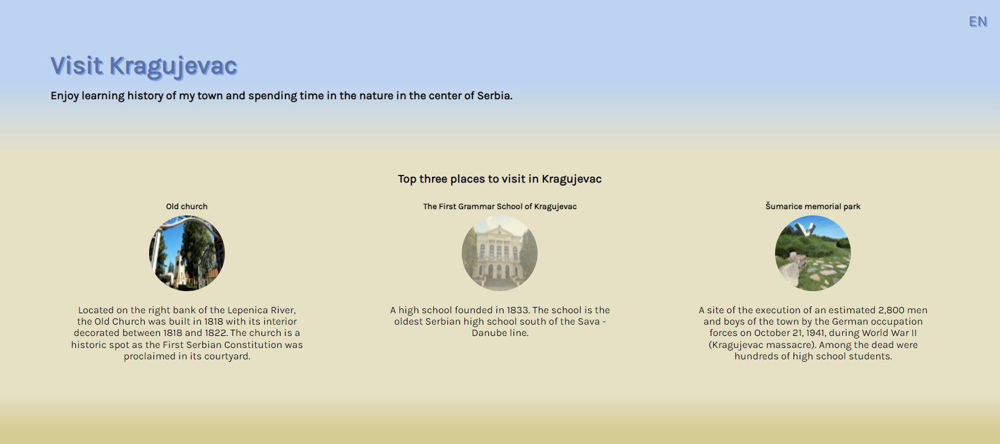
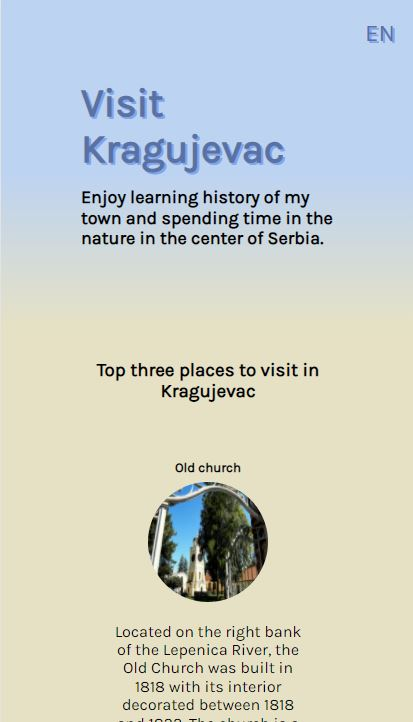

# Hometown Homepage (Kragujevac)

A simple static page about my hometown, Kragujevac, which displays three must-see places, gives a short description about them and contains my photo and quote at the bottom. This is a challenge - Solo project - on [The Frontend Career Path](https://scrimba.com/learn/frontend).

## Table of contents

- [Overview](#overview)
  - [Screenshot](#screenshot)
  - [Links](#links)
- [Process](#process)
  - [Built with](#built-with)
- [Author](#author)

## Overview

Users can see:
- top three places to visit in Kragujevac, their photos and description
- animations of some elements on the page

### Screenshot

### Links

- Live Site URL: [Hometown Homepage](https://jelenkoo10.github.io/hometown_homepage/)

## Process

### Built with

- Semantic HTML5 markup
- CSS custom properties
- Flexbox
- Desktop-first workflow
- [GSAP](https://greensock.com/gsap/) - JS animation library

## Author

- GitHub - [https://github.com/jelenkoo10](https://github.com/jelenkoo10)
- Frontend Mentor - [@jelenkoo10](https://www.frontendmentor.io/profile/jelenkoo10)
- LinkedIn - [Veljko Jelenković](https://www.linkedin.com/in/veljko-jelenkovi%C4%87-182981250/)